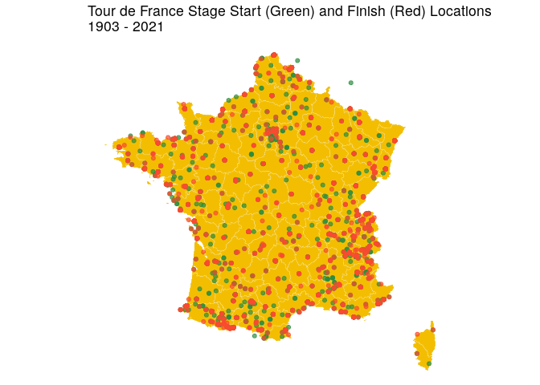

<!-- README.md is generated from README.Rmd. Please edit that file -->

# tdfData

An R package containing stage data for each edition of the Tour de
France (1903 - 2021).

## Install

Install using

``` r
# install.packages("devtools")
devtools::install_github("odaniel1/tdfData")
```

## About the Data

The R package contains a single dataset `tdf_stages`, summarised below:

<table>

<thead>

<tr>

<th style="text-align:left;">

Field

</th>

<th style="text-align:left;">

Class

</th>

<th style="text-align:left;">

Example

</th>

</tr>

</thead>

<tbody>

<tr>

<td style="text-align:left;">

Stage

</td>

<td style="text-align:left;">

character

</td>

<td style="text-align:left;">

1

</td>

</tr>

<tr>

<td style="text-align:left;">

Date

</td>

<td style="text-align:left;">

Date

</td>

<td style="text-align:left;">

1903-07-01

</td>

</tr>

<tr>

<td style="text-align:left;">

Distance

</td>

<td style="text-align:left;">

numeric

</td>

<td style="text-align:left;">

467

</td>

</tr>

<tr>

<td style="text-align:left;">

Start

</td>

<td style="text-align:left;">

character

</td>

<td style="text-align:left;">

Paris

</td>

</tr>

<tr>

<td style="text-align:left;">

Finish

</td>

<td style="text-align:left;">

character

</td>

<td style="text-align:left;">

Lyon

</td>

</tr>

<tr>

<td style="text-align:left;">

Year

</td>

<td style="text-align:left;">

numeric

</td>

<td style="text-align:left;">

1903

</td>

</tr>

<tr>

<td style="text-align:left;">

Start Latitude

</td>

<td style="text-align:left;">

numeric

</td>

<td style="text-align:left;">

48.8566969

</td>

</tr>

<tr>

<td style="text-align:left;">

Start Longitude

</td>

<td style="text-align:left;">

numeric

</td>

<td style="text-align:left;">

2.3514616

</td>

</tr>

<tr>

<td style="text-align:left;">

Finish Latitude

</td>

<td style="text-align:left;">

numeric

</td>

<td style="text-align:left;">

45.7578137

</td>

</tr>

<tr>

<td style="text-align:left;">

Finish Longitude

</td>

<td style="text-align:left;">

numeric

</td>

<td style="text-align:left;">

4.8320114

</td>

</tr>

</tbody>

</table>

With the exception of Latitude/Longitude values, all data has been
obtained from Wikipedia.

The Latitude/Longitude values have been obtained through geocoding,
using the R `tidygeocoder` package. Locations that have been flagged as
being outside of France in the Wikipedia table have been given `NA`
Latitude/Longitude values.

There are some data quality issues with the matched coordinate values:
for instance Stage 2 of the 2010 Tour is marked as starting in
*Rotterdam*, not *Rotterdam (Netherlands)*. The geocoding then tries to
match this to a location in France, landing on *Rue de Rotterdam,
Tours*.

## Example

``` r
library(tdfData)
library(ggplot2)

ggplot(tdf_stages) +
  # background map of france (coord_map fixes the aspect ratio)
  geom_polygon(
    data = map_data("france"), aes(x=long, y = lat, group = group),
    fill = "#f3be02", color = "#f6f4e6", size = 0.1
  ) +
  coord_map() +

  # stage start and finish locations as points
  geom_point(aes(x=`Start Longitude`,y=`Start Latitude`), color = "#2B8C40", alpha = 0.7) +
  geom_point(aes(x=`Finish Longitude`,y=`Finish Latitude`), color = "#F84B30", alpha = 0.7) +
  theme_void() +
  ggtitle("Tour de France Stage Start (Green) and Finish (Red) Locations\n1903 - 2021")
```


